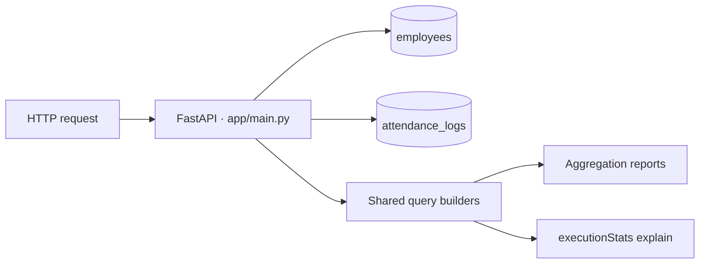

<div align="center">

# Employee Attendance & Analytics API

**Attendance that stays correct across midnight, concurrent requests and missing records.**

A FastAPI + MongoDB implementation of the HROne Software Engineer assignment.
Employee management, attendance corrections, four aggregation reports and real query-plan evidence.

[](https://github.com/Sushantku1099/employee-attendance-analytics-api/actions/workflows/verify.yml)


[Quick start](#quick-start) · [API reference](#api-reference) · [Design](#design) · [Verification](#verification) · [Limitations](#limitations)

</div>

> **Seed warning:** `sample_seed.py` deletes collection contents. Never run it against a valuable database. The regression runner does not use it.

## At a glance

| Delivered | Evidence |
|---|---|
| **12 API operations** | Employees, attendance, analytics, health and explain |
| **4 aggregation reports** | Calculations run in MongoDB rather than Python collection loops |
| **67 unittest tests + 38 helper checks per CI job** | Actual HTTP requests, production helpers and schema comparisons |
| **100,000 synthetic attendance logs** | Seven real executionStats plans checked for root and lookup collection scans |
| **MongoDB 6.0.28 and 7.0.43** | Both verified with Python 3.11.17 |
| **One application file** | All application code in [`app/main.py`](app/main.py) |

These are observed fixture results, not a claim that every possible input or hidden grading case passes.

## Quick start

### Run the API

Use **Python 3.11+**, an available **MongoDB 6.0+** instance and the repository root as your working directory.

```bash
python -m pip install -r requirements.txt
export MONGO_URI=mongodb://localhost:27017
export MONGO_DB=attendance_db
python -m uvicorn app.main:app --port 8000
```

| Local URL | Purpose |
|---|---|
| [`/health`](http://localhost:8000/health) | Readiness: 200 when MongoDB answers a ping, otherwise 503 |
| [`/docs`](http://localhost:8000/docs) | Interactive FastAPI documentation |
| [`/openapi.json`](http://localhost:8000/openapi.json) | Generated API schema |

A local `.env` is optional; real environment variables take priority. Startup creates indexes idempotently. No manual database setup or seed step is required.

### Run the isolated verification suite

With requirements already installed, Docker running and the `mongo:7` image already available:

```bash
python -B verify_phase3.py
```

**This is the authoritative test command.** It starts its own API and fresh MongoDB container, allocates a loopback port and unique database, overrides inherited database settings, and removes only its own process/container on completion or failure. It never uses your application database and installs nothing.

For the same suite against an already available MongoDB 6 image:

```bash
python -B verify_phase3.py --mongo-image mongo:6.0
```

CI installs from the same `requirements.txt`, pulls its selected image, and runs this isolated runner on both versions.

## API reference

The supplied [`openapi.yaml`](openapi.yaml) defines the authoritative paths, parameters, schemas and business rules. Start the API and use `/docs` to try requests.

| Method | Endpoint | Purpose | Success |
|---|---|---|---|
| `GET` | `/health` | MongoDB readiness | `200` |
| `POST` | `/employees` | Create an employee with a customer-supplied code | `201` |
| `GET` | `/employees` | Filter by department; paginate by employee code | `200` |
| `POST` | `/attendance/punch-in` | Create the attendance day's record | `201` |
| `POST` | `/attendance/punch-out` | Close the latest eligible record | `200` |
| `GET` | `/attendance` | Filter by employee, dates and status; paginate | `200` |
| `PATCH` | `/attendance/{emp_code}/{date}` | Correct a record and append its history | `200` |
| `GET` | `/analytics/employees/{emp_code}/monthly` | Employee working days and attendance totals | `200` |
| `GET` | `/analytics/departments/summary` | Department headcount and attendance summary | `200` |
| `GET` | `/analytics/leaderboard/late` | Competition-ranked late employees | `200` |
| `GET` | `/analytics/departments/{department}/trend` | Daily rates and seven-day moving average | `200` |
| `GET` | `/admin/explain/{endpoint}` | Raw executionStats for the actual query | `200` |

Missing resources return `404`, conflicts `409`, and invalid requests `422` where specified by the contract. Only health declares a `503` response.

<details>
<summary><strong>Example: create an employee and record a punch-in</strong></summary>

Run against the database you selected for normal API use. These requests create records.

```bash
curl -X POST http://localhost:8000/employees \
  -H 'Content-Type: application/json' \
  -d '{
    "emp_code": "EMP7001",
    "name": "Asha Rao",
    "email": "asha@example.com",
    "department": "Engineering",
    "joined_on": "2026-07-01"
  }'

curl -X POST http://localhost:8000/attendance/punch-in \
  -H 'Content-Type: application/json' \
  -d '{"emp_code": "EMP7001", "status": "PRESENT"}'
```

Omitting `punched_at` uses the server clock. Explicit `null` is rejected. Reusing an existing employee code returns `409`.

</details>

## Design



| Concern | Implementation |
|---|---|
| **Identity** | `emp_code` identifies employees; attendance records use `(emp_code, date)`. MongoDB IDs are internal, except raw plan fields retained in explain output. |
| **Duplicate prevention** | Unique indexes on `employees.emp_code` and `attendance_logs.(emp_code, date)`. Concurrent inserts rely on MongoDB enforcement. |
| **Safe updates** | Punch-outs and corrections match the record read earlier. A stale update returns `409`; a correction saves fields and appends history atomically. |
| **Punch-out selection** | The latest eligible record is selected even when closed. Repeated punch-out returns `409` rather than closing an older open shift. |
| **Audit trail** | Manual corrections append exactly one entry containing only actual changes. Punch-in/out do not append history. |
| **Analytics** | MongoDB pipelines read stored derived values. Employees without logs still contribute to eligible headcount. |
| **Explain** | Reports and explain use shared builders with the same filters, sort, pagination and index hints. BSON plan values retain Extended JSON representation. |

### Business rules worth checking in a walkthrough

| Rule | Required behavior |
|---|---|
| **Time and dates** | API instants are strict integer epoch milliseconds; stored instants are UTC BSON datetimes truncated to whole seconds. Calendar dates and shifts use IST. |
| **Overnight shifts** | A punch before an overnight shift's end belongs to the previous attendance date. |
| **Late grace** | Exactly 10 minutes is allowed. At 09:40:01 for a 09:30 shift, late minutes equal 10. |
| **Overtime** | Count whole minutes past shift end only once the delay reaches 30 minutes. |
| **Half day** | Rounded work hours below 4.50 count as half a present day. |
| **Rounding** | Half-up: two decimal places for reported numbers, four for rates. |
| **Working days** | Monday–Friday, adjusted for joining date. Weekend records can still contribute late/overtime totals. |
| **Ranking** | Ties use competition ranks such as `1, 2, 2, 4`; the limit applies to rank, so ties may return extra rows. |
| **Trend gaps** | Every calendar day appears, including weekends and dates without logs. |
| **Pagination** | Page starts at 1; page size defaults to 20, maximum 100; total reflects the applied filters. |

## Verification

### Verified merged-main build

[**Successful automatic main-push matrix run →**](https://github.com/Sushantku1099/employee-attendance-analytics-api/actions/runs/38029819710)

Commit: [`8ba3aa74a25b5350b13eb7e284f637fa95788a79`](https://github.com/Sushantku1099/employee-attendance-analytics-api/commit/8ba3aa74a25b5350b13eb7e284f637fa95788a79) · 10 October 2026 · Event: `push`

| Environment | Observed result |
|---|---|
| Python 3.11.17 + MongoDB 6.0.28 | **67 unittest tests + 38 helper checks passed** |
| Python 3.11.17 + MongoDB 7.0.43 | **67 unittest tests + 38 helper checks passed** |

Both jobs also passed empty-database analytics, startup/index checks, served-schema equality and representative query plans. The closed-latest-record regression passed. Six parallel punch-outs produced one `200` and five `409` responses. The logs confirm removal of each run's disposable container.

The permanent comparator found **zero normalized structural differences**, with no field exceptions. It compares paths, methods, parameter collections, request/response schemas, required fields and constraints. Metadata and equivalent schema representations are normalized; this is not byte-for-byte OpenAPI equality or a proof of runtime behavior.

[Workflow](.github/workflows/verify.yml) · [Detailed verification history](REVIEW.md) · [Implementation decisions](DECISIONS.md)

<details>
<summary><strong>Database-free checks</strong></summary>

```bash
python -B static_helper_tests.py
python -B openapi_tests.py
python -B openapi_contract_tests.py
python -B phase2_unit_tests.py
python -B phase3_schema_tests.py
```

Tests import production helpers/models rather than maintaining duplicate implementations. Integration suites are separate and should be invoked through the isolated runner.

</details>

## Repository guide

| File | Role |
|---|---|
| [`PROBLEM_STATEMENT.docx`](PROBLEM_STATEMENT.docx) | Assignment instructions and submission requirements |
| [`openapi.yaml`](openapi.yaml) | Authoritative HTTP contract and R1–R10 |
| [`DATA_MODEL.md`](DATA_MODEL.md) | Supplied collection shapes, seeded data rules and examples |
| [`app/main.py`](app/main.py) | All application code |
| [`verify_phase3.py`](verify_phase3.py) | Full isolated regression runner |
| [`REVIEW.md`](REVIEW.md) | Findings, fixes, commands, results and dated history |
| [`DECISIONS.md`](DECISIONS.md) | Design choices for the live walkthrough |
| [`sample_data/`](sample_data/) | Supplied sample documents; preserved for evaluation |

## Limitations

- **Reproducibility:** requirements use lower bounds rather than a verified lock; MongoDB image tags remain mutable. CI proves the installation it ran, not bit-for-bit reproducibility.
- **Database outages:** health returns `503`; other routes do not translate connectivity failures into a uniform response. No undocumented response codes were added.
- **Schema comparator:** external references, self-referential schema cycles and unused component definitions are outside its supported comparison scope.
- **Unverified scenarios:** hidden grader data, long-history stress, cold index creation on 100,000 preseeded logs and every deployment/filter combination.

Keep secrets, `.env`, environments, caches, Dockerfiles and dumps out of the submission. Required assignment documents and supplied samples remain in the repository. No hidden-grader result or evaluation score is claimed.
